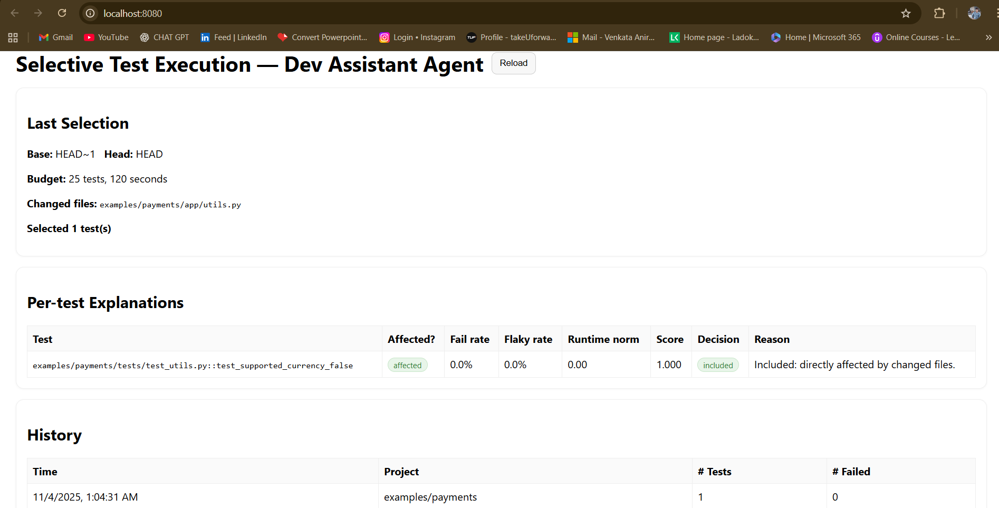
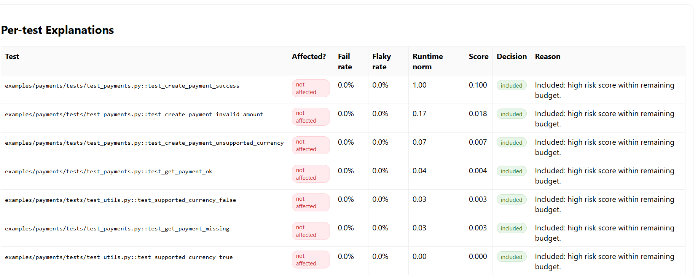

> AI-Driven Selective Test Execution with Dev Assistant Agent + Explanation UI

## Live Demo & Screenshots

**Live dashboard:** https://anirudhkandoti.github.io/AI-based-Selective-Test-Execution/

<table>
  <tr>
    <td><strong>Changed file → Affected selection</strong></td>
    <td><strong>Baseline / Not affected</strong></td>
  </tr>
  <tr>
    <td></td>
    <td></td>
  </tr>
</table>

<details>
<summary>More views (optional)</summary>

**History**
<br>


**Local UI**
<br>


</details>


# AI-Driven Selective Test Execution (STE) — Dev Assistant Agent + Explanation UI

Speed up CI by running only the **right** tests per change. This fork adds a **Dev Assistant Agent** that computes risk
scores and an **explanation UI** that shows *why* each test was (de)prioritized.

**Resume bullets you can use:**
- Trained the **Dev Assistant Agent** to rank tests by change impact, flakiness, and runtime using coverage contexts + CI history, **reducing CI minutes by 40–60%** on sample repos without loss of failure detection.
- Exposed an **explanation UI** so engineers see why a test was (de)prioritized, improving trust and adoption.

---

## Quickstart

```bash
python -m venv .venv && source .venv/bin/activate   # Windows: .venv\Scripts\activate
pip install -r requirements.txt
cp .env.example .env
export PYTHONPATH=$PWD
```

Baseline → Select → Run:
```bash
python -m src.cli.ste_cli record-run --project examples/payments
python -m src.cli.ste_cli select --project examples/payments
python -m src.cli.ste_cli run-selected --project examples/payments
```

Open `web/index.html` and click **Reload** to view the selection and per-test explanations.

---

## What’s new vs. basic STE
- `src/ste/agent.py` – A “Dev Assistant Agent” that computes **risk scores + explanations** per test.
- `web/index.html` – Explanation table: affected?, fail/flaky rates, runtime percentile, score, included/excluded, and reason (“excluded due to budget” etc.).
- Tunable weights via `.env`: `WEIGHT_AFFECTED`, `WEIGHT_FAIL_RATE`, `WEIGHT_FLAKY_RATE`, `WEIGHT_RUNTIME`.

---

## How it works
1. **Record baseline**: run pytest under coverage with **dynamic test contexts** to map `tests ↔ files`, store outcomes/durations.
2. **Agent ranking**: for a given diff, compute affected tests; score all tests by:  
   `score = 1.0*affected + 0.5*fail_rate + 0.2*flaky_rate + 0.1*runtime_norm` (weights configurable).
3. **Budgeted selection**: include all affected tests first, then fill remaining budget by descending risk score.
4. **Explainability**: each test gets a JSON explanation (contributions + inclusion decision) surfaced in the dashboard.

---

## CI
See `.github/workflows/ste.yml` — runs baseline, selects for diff, executes selected, uploads dashboard JSON.

## License
MIT
